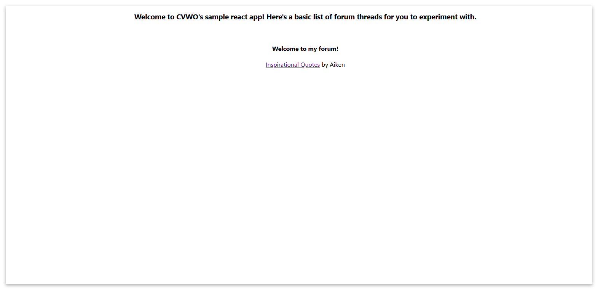

# Forum Frontend

This project is developed based on CVWO sample app. The project is a basic frontend prototype of a web forum application, where the backend part can be referred [here](https://github.com/li-rongzhi/forum-backend).

## Getting Started

### Running the app

1. [Fork](https://docs.github.com/en/get-started/quickstart/fork-a-repo#forking-a-repository) this repo.
2. [Clone](https://docs.github.com/en/get-started/quickstart/fork-a-repo#cloning-your-forked-repository) **your** forked repo.
3. Open your terminal and navigate to the directory containing your cloned project.
4. Install dependencies for the project by entering this command:

```bash
yarn install
```

5. Run the app in development mode by entering this command:

```bash
yarn start
```

6. Open [http://localhost:3000](http://localhost:3000) to view it in the browser.
7. You should see a page like this.
   

### Navigating the code

This is the main file structure

```
.
├── node_modules
├── public
├── src
├── README.md
├── tsconfig.json
├── package.json
├── .eslintrc.js
├── .prettierrc.js
└── yarn.lock
```

Main directories/files to note:

-   `src` usually includes all your source code. That is where most of your functional code will be.
-   `README.md` is a form of documentation about the project. It is what you are reading right now.
-   `package.json` contains important metadata, for example, the dependencies and available scripts in the project.
-   `.eslintrc.js` contains the configuration for ESLint. ESLint is a tool to help enforce code consistency.
-   `.prettierrc.js` contains the configuration for Prettier. Prettier is a tool to help format code.
